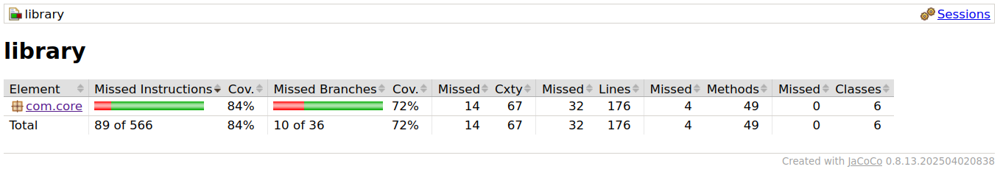

# 📚 Proyecto de Librería - Portafolio TDD y Testing Ágil

Este repositorio contiene el desarrollo de un proyecto de librería usando Java, SQLite y pruebas automatizadas con TDD (Test Driven Development) como parte del portafolio de los módulos 2 y 3.

## Instrucciones de ejecución

En el repositorio se encuentra dos archivos pom segun corresponda el OS.
```bash
.
├── pom.xml.linux
├── pom.xml.windows
```

Elegir el que corresponda y renombrar a pom.xml
```bash
mv pom.xml.linux pom.xml
```

Luego instalar dependencias y ejecutar pruebas
```bash
mvn clean install
```
---


# 🧩 4️⃣ Integración de Teoría (Módulo 2) con Práctica (Módulo 3)

## ✅ Historia(s) de Usuario

### 🧾 HU01 – Listar libros
**Como** usuario de la librería  
**Quiero** ver todos los libros disponibles  
**Para** conocer el catálogo completo.

**Criterios de aceptación:**
- El sistema debe listar todos los libros con los campos: título, autor, precio y descuento, si aplica.
- El listado debe excluir libros que hayan sido eliminados por falta de stock.
- Se mostrarán los libros listados por orden alfabético del título.

---

### 🔍 HU02 – Buscar por título
**Como** usuario  
**Quiero** buscar un libro por su título  
**Para** encontrarlo fácilmente.

**Criterios de aceptación:**
- La búsqueda debe aceptar coincidencias parciales (e.g. “Cien” devuelve “Cien años de soledad”).
- La búsqueda debe ser insensible a mayúsculas/minúsculas.
- Si no hay resultados, debe mostrarse un mensaje indicando que no se encontraron coincidencias.

---

### 🧑‍🎓 HU03 – Filtrar por autor
**Como** lector  
**Quiero** filtrar libros por autor  
**Para** revisar obras de mi autor favorito.

**Criterios de aceptación:**
- Al ingresar el nombre del autor, se deben mostrar todos sus libros disponibles.
- El filtro debe funcionar con coincidencias parciales del nombre del autor.
- El resultado debe excluir libros sin stock del autor seleccionado.

---

### 💰 HU04 – Modificar precio aplicando descuento
**Como** administrador  
**Quiero** modificar el precio aplicando un descuento  
**Para** actualizar promociones vigentes.

**Criterios de aceptación:**
- El nuevo precio debe calcularse correctamente según el porcentaje de descuento.
- Si el descuento es 0%, el precio original no debe cambiar.
- El descuento no debe ser negativo ni superar el 100% (se debe validar el valor ingresado).

---

### 🗑️ HU05 – Eliminar libro si no hay stock
**Como** administrador  
**Quiero** eliminar un libro del sistema si ya no está en stock  
**Para** mantener la base de datos limpia y actualizada.

**Criterios de aceptación:**
- Si el stock del libro llega a 0, debe eliminarse automáticamente de la base de datos o marcarse como inactivo.
- El libro eliminado ya no debe aparecer en búsquedas ni listados.
- Debe registrarse un log o mensaje de confirmación al eliminar un libro por falta de stock.

---

## ✅ Tipos de Pruebas

- **Unitarias**: pruebas sobre cada operación individual (`createBook`, `getBooks`, etc.).
- **Integración**: pruebas conectando con la base de datos real SQLite.
- **Aceptación**: validación de criterios funcionales completos usando ejemplos de historias de usuario.

---

## ✅ Definición de “Terminado”

- Código funcional implementado con TDD (ciclo Red-Green-Refactor).
- Todas las pruebas pasan correctamente.
- Se obtiene ≥80% de cobertura con JaCoCo.
- Repositorio limpio con commits frecuentes y mensajes descriptivos.
- Refactorizaciones documentadas aplicando principios SOLID.

---

## ✅ Plan de Ejecución de Pruebas durante el Sprint

- Cada historia de usuario se abordará con su respectivo test antes del código (TDD).
- Se integrará la validación con SQLite desde el inicio (usando repositorio y JDBC).
- Se verificará la cobertura y se refactorizará tras cada prueba exitosa.
- Se revisará funcionalidad contra los criterios de aceptación.
- Se ejecutarán pruebas automáticas con `mvn test` y se documentarán los resultados.

---


## ✅ Roles Involucrados en el Sprint

| Rol           | Responsabilidad                                                  |
|----------------|------------------------------------------------------------------|
| Developer      | Implementa lógica, pruebas unitarias y conexión BD              |
| QA             | Revisa criterios, realiza plan de pruebas, ejecuta pruebas de integración |
| Revisor (par)  | Evalúa código y da feedback sobre buenas prácticas              |
| Product owner  | Define historias de usuario, revisa cumplimiento de entregables y criterios |
| Scrum master   | Facilitador para el equipo de desarrollo                         |

---

## ✅ Refactorizacion del código

En la clase SqliteBookRepository se mezcla la logica de los operadores SQL,
la logica para realizar la operacion, y la logica del manejo de errores y adaptacion con el modelo.

```java
// SqliteBookRepository.java
package com.core;

import java.sql.*;
import java.util.*;

public class SqliteBookRepository implements BookRepository {
    private void initTable() {
        String sql = "CREATE TABLE IF NOT EXISTS books ( id INTEGER PRIMARY KEY, title TEXT NOT NULL, author TEXT NOT NULL, price REAL NOT NULL, discount REAL NOT NULL );";
        try (Connection conn = connect(); Statement stmt = conn.createStatement()) {
            stmt.execute(sql);
        } catch (SQLException e) {
            throw new RuntimeException("Failed to initialize database", e);
        }
    }

    @Override
    public boolean storeBook(Book book) {
        String sql = "INSERT INTO books (id, title, author, price, discount) VALUES (?, ?, ?, ?, ?)";
        try (Connection conn = connect(); PreparedStatement pstmt = conn.prepareStatement(sql)) {
            pstmt.setInt(1, book.getId());
            pstmt.setString(2, book.getTitle());
            pstmt.setString(3, book.getAuthor());
            pstmt.setFloat(4, book.getPrice() / book.getDiscount()); // store original price
            pstmt.setFloat(5, book.getDiscount());
            
            int affected = pstmt.executeUpdate();

            if (affected == 0) {
                return false;
            }

            ResultSet keys = pstmt.getGeneratedKeys();
            if (keys.next()) {
                book.setId(keys.getInt(1));
                return true;
            }

            return false;
            } catch (SQLException e) {
                e.printStackTrace();
                return false;
            }
    }
    // ... more code
}

```

Para una separación efectiva de responsabilidades siguiendo el principio SOLID de responsabilidad única, separaremos las query SQL en una clase SqlStatementBuilder y las operaciones SQL en un Database Access Object, lo cual es una practica común en bases de datos:

```java
// SqlStatementBuilder.java
package com.core;

public class SqlStatementBuilder {

    public static String createTable() {
        return "CREATE TABLE IF NOT EXISTS books ( id INTEGER PRIMARY KEY, title TEXT NOT NULL, author TEXT NOT NULL, price REAL NOT NULL, discount REAL NOT NULL );";
    }

    public static String insertBook() {
        return "INSERT INTO books (title, author, price, discount) VALUES (?, ?, ?, ?)";
    }
    // ... more code
}
```

```java
// BookCommandDAO.java
package com.core;

import java.sql.*;
import java.util.ArrayList;
import java.util.List;

public class BookCommandDAO {
    private final Connection conn;

    public BookCommandDAO(Connection conn) {
        this.conn = conn;
    }

    public void createTable() throws SQLException {
        String sql = SqlStatementBuilder.createTable();
        Statement stmt = conn.createStatement();

        stmt.execute(sql);
    }

    public boolean store(Book book) throws SQLException {
        String sql = SqlStatementBuilder.insertBook();
        PreparedStatement pstmt = conn.prepareStatement(sql, Statement.RETURN_GENERATED_KEYS);

        pstmt.setString(1, book.getTitle());
        pstmt.setString(2, book.getAuthor());
        pstmt.setFloat(3, book.getPrice() / book.getDiscount());
        pstmt.setFloat(4, book.getDiscount());

        int affected = pstmt.executeUpdate();

        if (affected == 0) {
            return false;
        }

        ResultSet keys = pstmt.getGeneratedKeys();
        if (keys.next()) {
            book.setId(keys.getInt(1));
            return true;
        }

        return false;
    }
    // ... more code
}
```

Con estas dos clases, refactorizamos SqliteBookRepository

```java
// SqliteBookRepository
package com.core;

import java.sql.*;
import java.util.*;

public class SqliteBookRepository implements BookRepository {
    private final String dbPath;
    private final boolean inMemory;
    private Connection conn;
    private BookCommandDAO commandDAO;

    private void initTable() {
        try {
            commandDAO.createTable();
        } catch (SQLException e) {
            LoggingService.log("Failed to initialize database");
            throw new RuntimeException(e);
        }
    }

    @Override
    public boolean storeBook(Book book) {
        try {
            return commandDAO.store(book);
        } catch (SQLException e) {
            LoggingService.log(e.getStackTrace().toString());
            return false;
        }
    }

    // ... more code
}
```

De esta forma separamos efectivamente las responsabilidades, mejorando la legibilidad del código y facilitando su mantenimiento, el resto del codigo puede ser encontrado en el repositorio.

---

## 🧪 Uso de Mockito en `BookModelTest`

### 🔧 Setup general
- `BookRepository` es **mockeado** usando `mock(BookRepository.class)` en el `@BeforeMethod`.
- Se aplica `when(repository.getBooks()).thenReturn(...)` para simular libros preexistentes.

---

### 📌 Stubbing (`when(...)`)
Se usaron *stubs* para definir comportamientos específicos del mock:

| Método Stubbed                     | Condición Simulada                              | Ciclos donde se usó                        |
|-----------------------------------|--------------------------------------------------|--------------------------------------------|
| `repository.storeBook(any())`     | Retorna `true` o `false` según el caso          | Crear libro exitoso / con error (1 y 2)    |
| `repository.updateBook(any())`    | Retorna `true` al aplicar descuento             | Descuento exitoso (9)                      |
| `repository.removeById(1)`        | Retorna `true` al eliminar por ID               | Remoción exitosa (11)                      |

---

### ✅ Verificaciones (`verify(...)`)
Se aplicaron verificaciones para asegurar la interacción con el mock:

| Verificación                        | Propósito                                      | Test Asociado                                |
|------------------------------------|------------------------------------------------|----------------------------------------------|
| `verify(repository).storeBook(...)`| Verifica que `storeBook` se haya llamado       | Crear libro (ciclos 1 y 2)                   |
| `verify(repository).updateBook(...)`| Confirma actualización tras aplicar descuento | Descuento exitoso (9)                        |
| `verify(repository).removeById(1)` | Verifica eliminación correcta                  | Remoción exitosa (11)                        |
| `verify(repository, never()).removeById(anyInt())` | Confirma que no se llamó al método | Remoción fallida (12)                        |

---

### 🚫 ArgumentMatchers
Se utilizaron *matchers* como `any()` y `anyInt()` para evitar coincidencias estrictas de argumentos:

- `any(Book.class)`: usado en stubs y verificaciones para almacenar o actualizar libros.
- `anyInt()`: usado en verificación `never()` para IDs inexistentes.

---

### 🎯 Patrón general aplicado
- **Control estricto** del repositorio simulado sin tocar la implementación real.
- **Aislamiento del sistema bajo prueba** (`BookModel`) asegurando que la lógica se probó con entradas controladas.
- **Validación de interacciones y efectos secundarios**, cumpliendo principios clave de TDD y diseño limpio.

---

## 📘 Ciclos TDD en `BookModelTest`

### 🧪 Ciclo 1: Crear libro exitosamente
- **Red**: Se escribe `testCreateBook_ShouldStoreBook` sin implementación.
- **Green**: Se implementa `createBook` para almacenar libros en el repositorio.
- **Refactor**: Limpieza de dependencias, uso de `verify`.

---

### 🧪 Ciclo 2: Fallo al crear libro
- **Red**: Se crea `testFailCreateBook_ShouldLogError` esperando `storeBook` falso.
- **Green**: `createBook` maneja el error y retorna el objeto sin almacenar.
- **Refactor**: Revisión de lógica para logging o retrocompatibilidad.

---

### 📚 Ciclo 3: Obtener libros existentes
- **Red**: Se llama `getBooks` y no devuelve nada.
- **Green**: Se implementa método que llama al repositorio.
- **Refactor**: Validación de objetos y tamaño de lista.

---

### 🔍 Ciclo 4: Buscar libro por ID válido
- **Red**: `findBookById` no retorna el libro correcto.
- **Green**: Implementación con recorrido y comparación de ID.
- **Refactor**: Separación lógica entre filtrado y respuesta.

---

### ❌ Ciclo 5: No encontrar libro por ID
- **Red**: Se espera `null` para ID inexistente.
- **Green**: Lógica para retorno de `null` si no se encuentra.
- **Refactor**: Reducción de complejidad condicional.

---

### 🔎 Ciclo 6: Buscar por título
- **Red**: Título buscado no da resultados.
- **Green**: Implementación por coincidencia exacta.
- **Refactor**: Optimización de búsqueda (case-insensitive si aplica).

---

### 🧑‍💻 Ciclo 7: Filtrar por autor
- **Red**: Se espera coincidencia y no ocurre.
- **Green**: Se filtran libros por autor con `.equals`.
- **Refactor**: Modularización del filtro para reutilización.

---

### 💸 Ciclo 8: Filtrar por precio
- **Red**: El método no devuelve los libros esperados.
- **Green**: Implementación lógica de comparación por precio.
- **Refactor**: Separación de filtros como helper privado.

---

### 🏷️ Ciclo 9: Aplicar descuento exitosamente
- **Red**: `applyDiscount` no modifica el libro.
- **Green**: Se actualiza el objeto y se llama a `updateBook`.
- **Refactor**: Validación de campos antes de aplicar descuento.

---

### 🚫 Ciclo 10: Fallo al aplicar descuento
- **Red**: Descuento sobre ID inexistente debería dar `null`.
- **Green**: Verificación del ID antes de ejecutar lógica.
- **Refactor**: Simplificación del control de flujo.

---

### 🗑️ Ciclo 11: Remover libro exitosamente
- **Red**: `removeById` falla al eliminar libro válido.
- **Green**: Verifica existencia y llama a `removeById`.
- **Refactor**: Consolidación de estado y confirmación de acción.

---

### 🚷 Ciclo 12: No remover libro inexistente
- **Red**: El método elimina sin verificar existencia.
- **Green**: Implementación devuelve `false` si no se encuentra ID.
- **Refactor**: Prevención de operaciones inútiles.

---

## ✅ Cobertura de código por jacoco




## 🧠 Reflexión Final
Durante el desarrollo del proyecto, aprendimos a aplicar los principios del Testing Ágil y a integrar el enfoque TDD (Red-Green-Refactor) para construir funcionalidades desde los tests. Este enfoque nos ayudó a tener mayor claridad sobre los requisitos y a detectar errores desde etapas tempranas.

Una de las principales dificultades fue configurar correctamente el entorno de pruebas con TestNG y simular interacciones con la base de datos sin romper la lógica de negocio. Para resolverlo, utilizamos mocks y mejoramos la estructura del código siguiendo buenas prácticas.

Trabajar con ciclos TDD fue desafiante al principio, pero con el tiempo resultó motivador y satisfactorio ver cómo las pruebas guiaban el diseño del código. Si repitiéramos el proyecto, organizaríamos mejor los paquetes desde el inicio y automatizaríamos aún más la cobertura de pruebas para mantener la calidad del software.
